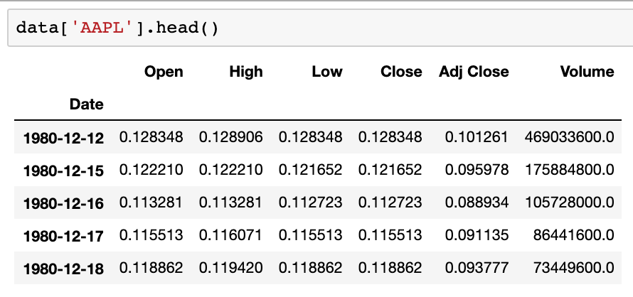

# Stocks Prediction
> *This project is part of a series worked on as a part of my Udacity Nanodegree program. As this is the capstone project, I have built it from scratch.*

> **Machine Learning Engineer Nanodegree at Udacity** *sponsored by AWS*

*Update November 1, 2020: I have submitted the project, but will be committing new changes till I have solved the [problem statment](#problem-statement).*

---

# Table of Contents
- [Table of Contents](#table-of-contents)
- [Table of Figures](#table-of-figures)
- [Capstone Project Report](#capstone-project-report)
  - [Project Overview](#project-overview)
  - [Domain Background](#domain-background)
  - [Problem Statement](#problem-statement)
  - [Evaluation Metrics](#evaluation-metrics)
  - [Data Exploration and Visualisation](#data-exploration-and-visualisation)
  - [Algorithms and Techniques](#algorithms-and-techniques)
    - [Data Anomalies](#data-anomalies)
  - [Benchmark Model](#benchmark-model)
  - [Data Processing](#data-processing)
  - [Implementation](#implementation)
  - [Refinement](#refinement)
  - [Model Evaluation and Validation](#model-evaluation-and-validation)
  - [Results](#results)
  - [Reflection](#reflection)
  - [References](#references)

# Table of Figures

- [Figure 1: Example Stock Price vs Time graph with predicted values](images/metric-example-graph.png)
- [Figure 2: Example Stock Price data Image](images/data_example.png)

# Capstone Project Report

Raj Dholakia

October 31, 2020

## Project Overview
I started with the aim of predicting prices of three stocks and came down using one while I prepared data to be processed. I have finally narrowed it down to training two different models and comparing their performance on `AAPL` stock data (in particular it's daily adjusted close price).

This is my first independent project of this level and as my nature is, I took up a task rather ambituous to be completed on time. However, I have learnt many from the many mistakes I have made during this journey and intend to work on this project post my submission as part of the Machine Learning Nanodegree.

I decided to break down my project into three different parts:
1. Exploratory Data Analysis
2. Data Preparation
3. Model Training and Testing

I focused a lot on ensuring code is clean, graphs are neat and everything is understandable and modular. Everything went smoothly till I reached the Model training part. When I realised what my first mistake was: **ambitious goals**.

It is good to have ambitious goals, it is smarter to ensure they are realistic. I had filled my plate with everything I found interesting and now I did not have the time to finish it all. I had to cut down, which I did not do till the last minute. Now I am going to focus on the Rubric provided. Starting with the origin of this idea of working on stocks data in the next section: **Domain Background**.

> *Following three sections are almost the same as the ones mentioned in the project proposal.*

## Domain Background

An ideal real-world application of machine learning is in the world of trading and investing. It all works on predicting what will have to the price of a stock in the next few minutes or a few years. Hence, the aim is to **predict** and there is a **large amount of historical data** available to assist in making a prediction. Laying out the foundation to apply some machine learning algorithms.

Having said that, the field is yet part of active research. The uncertain nature of stock prices and the time-series aspect of the problem makes it a particularly difficult one to solve. Then again, considering the fact that the field is all about money, a lot research has already been done. Even a decent prediction model, attracts a lot of attention in the field (Asadi _et al._, 2012; Agarwal and Sabitha, 2017)

There are two broad ways one can go about predicting the price of a stock. The first is through **technical analysis**. The historical price data of a stock is used to predict the future price. The second being **fundamental analysis** , which uses unstructured textural information to understand the market sentiment and predict what will happen to the price of a stock. Information sources for the latter approach include news and social media (Subhi Alzazah and Cheng, 2020).

One of the researches cited above worked on &quot;_SENSEX&#39;s Index dataset since 2006 to 2016 for time series forecasting using Rapid miner_&quot; (Agarwal and Sabitha, 2017). This is particularly important because we will be using two indices and one stock in this project.

I decided to take on this problem due to my interest in finance and some internship experience at a start-up that focuses on machine learning applications in intraday trading. I believe working on this project will give me a better understanding of the financial markets (finance in general) and time-series machine learning problems. As I have new to the world of machine learning and finance, I have decided to carry out technical analysis using the historical data of stocks.

## Problem Statement

**The aim of this project is to predict the long-term price trend of one stock with at least 90% accuracy.1** Two models' performances will be compared: ARIMA and DeepAR. In the end, the ability of the DeepAR model to predict the next ten months worth of data is tested. More importantly, the model&#39;s ability to predict how the stocks performed in 2020 (the year of the pandemic) will be observed. There are multiple options when it comes to time series forecasting and I have decided to do a univariate prediction. As this is the first time I am independently working on time series data, it is important I keep things as simple as possible. Hence open, high, low, close prices will not be predicted, only adjusted close price will used for the prediction.

In the end, the model should be able to able to predict a general trend of the time series. One particular graph that will give a visual indication of the solution being reached is the quantiles graph. The aim is to use 30-70% quantiles of the predictions to encompass the true time series.

_1 90% accuracy can be taken as 10% mean absolute percentage error._

## Evaluation Metrics

I will be using two main evaluation metrics to understand the model&#39;s performance. 
> One will be quantitative and the other will be visual (can be converted to quantitative):

1. **Mean Absolute Percentage Error (MAPE)**: It is the mean of percentage of absolute errors of the predictions. The following formula explains how it is calculated (&#39;MEAN ABSOLUTE PERCENTAGE ERROR (MAPE)&#39;, 2006; Glen, 2011) :

2. **Percentage Points Correctly Predicted** : This is more of a visual indicator of how the model is doing. It is the percentage of actual points that lie in the 30-70 (shorter inter-quartile) range of the predictions.

In the example graph above, it is clear that there are 3 out of 5 points fall in the 30-70 quartile range. Hence,

I came up with this metric as a solution to the problem predicting for larger intervals. I intend to use this to be understand of the model can make accurate predictions on the long-term trends. However, some weakness of the metric would be its inability to give great results for predictions with high variability (standard deviation). As a high standard deviation would be a larger area is covered by the predictions, the probability of the actual value to land within the 30-70 range is higher. However, if the standard deviation is high, the model is not following any specific trend (up or down) but is just spreading in both directions, leading to an inaccurate measure of what is actually happening.

Hence, a combination of MAPE and Percentage Points will give a better understanding of how the model is performing.

Other metrics like the `mean squared error (MSE)` and `root mean squared error (RMSE)` can be used to further support MAPE. As MAPE is a percentage value it will be easier to compare it with other stocks of different prices. Additionally, as the stock price starts with low values (in the 20th Century) and starts rising over time, it is important to use a metric that is independent of price.

> *The following sections report on reasoning and results of the project.*

## Data Exploration and Visualisation
> Notebook 1_Exploratory_Data_Analysis

The data was first loaded and features of the data understood and explained in the notebook. Above is a picture containing the first five rows of `AAPL` stock price data. This included meaning of `OHLC` prices and `Adj Close` price. All these prices are very strongly correlated to each other for `AAPL`. The data for the three stock and/or indices were then looked visually inspected to determine the length of time series data to be taken. It is noticed that most of the data before `2002` was almost constant when considering the changes post `2002` for Apple Inc. Furthermore, the decision to use `Adj Close` for project was taken after understanding different types of time series forecasts. To predict multiple prices using one model, multi-variate time series prediction is to be utilised, which is beyond the scope of this project.

One of the major anomalities of the data is the missing values for weekends and bank holidays. As it can be seen in the example above, data is missing for days and those are the times the stock market was closed. This is a concern in time series data analysis as it creates a time gap. Bank holidays especially are a problem as it becomes difficult to take into account all the holidays when considering over 20 years of data. This specific characteristic of the data needs to be managed carefully.

## Algorithms and Techniques
> Notebook 2_Data_Preparation
Two algorithms are used in this project:
1. Auto-Regression Integrated Moving Average (ARIMA)
2. AWS DeepAR

A section in the notebook is dedicated to dicussing the insides of each of the models. Not only was the working of the algorithm be understood, but also the varying formats in which both accept data were to be understood well. Data is then prepared for each of the models. 

The train-test split for both the model is different. The train-test split being created for DeepAR will contain multiple time series, while for the ARIMA model one large time series will be split into train and test dataset. If the Maintaining the prediction length for both the models, the data split percent will be quite differently. ARIMA model will be provided one a train series of around 218 months long and test time would include the last 10 months of 2019. Both the models will be tested on the first 10 months of 2020 (Jan 2020 - Oct 2020). This will ensure a more robust comparison between the two.

The time series is to be made stationary to hold all assumptions made for the ARIMA algorithm. The test for stationarity (`Augmented Dickey-Fuller Test`) is used to determine if the time series can be assumed to be stationary. This discussion is done in Notebook `3_Model_Train_Test`.

On the other hand, DeepAR requires multiple time series in a `JSON Lines` format. The algorithms takes train and test data and trains a neural network to predict the `prediction_length` using a given `context_length`. Once the model is trained, we can also make predtions from a given timestamp (we will use this feature to get predictions from January 1, 2020).

The parameters taken by both the models are of great importance to how the model performs. The discussion on parameter selection can be found in Notebook `3_Model_Train_Test`.

### Data Anomalies
One of the major concerns in the data is the missing data for bank holidays and weekends. This is common as stock markets will not be open on that day. As we have daily data, it is necessary that it is taken care of. In notebook 2_Data_Preparation, I had decided to keep missing data and let DeepAR algorithm handle it. However, when training a DeepAR model, an error kept preventing the data from being read. After numerous attempts at ensuring the data is in the correct `JSON Line` format, I decided to remove all the `Nan` values. After removal of all of these, the model trained. I realised the hard way that one of the sources might not have misguided me.

> Flunkert, V. et al. (2018) Amazon SageMaker DeepAR now supports missing values, categorical and time series features, and generalized frequencies | AWS Machine Learning Blog, Amazon SageMaker, Artificial Intelligence. Available at: https://aws.amazon.com/blogs/machine-learning/amazon-sagemaker-deepar-now-supports-missing-values-categorical-and-time-series-features-and-generalized-frequencies/ (Accessed: 29 October 2020).

## Benchmark Model
The results obtained by Nagesh Singh Chauhan in his analysis of Altaba Inc. stock from _1996–04–12_ till _2017–11–10_ (Chauhan, no date). He managed to get a MAPE value of **3.5%**, which can be said to be **96.5% accuracy**, using a well-tuned **ARIMA model**. In this project, the goal will be to get the MAPE value to be less than 90%.

This is a very particular example and it could turn out of that the results obtained are not as expected. I will be identifying the shortcomings of the analysis.

## Data Preprocesssing
Time series data usually do not require preprocessing, apart from management of missing values. In our case, we need to manage missing values and ensure the indexing of the values is done correctly. While, the latter has been a recent discovery, the former has been addressed in Notebook `2_Data_Preparation`. 

> Deeper discussion in [Data Anomalies and Implementation](#data-anomalies-and-implementation)

First all the missing dates were added to the series with `Nan` values. Then these missing values were filled with interpolated values. As we are dealing with a time series problem, interpolation is the best option. Further investigation can be done on the effects of higher order interpolation on the performance of the models, but that is beyond the scope of this project.

## Implementation
I have clearly explained every step taken in all the three notebooks. The second metric decided upon is slightly complicated as I have not been able to find resources that teach how to get quantiles from an ARIMA model. Hence, it is now limited to a graphical representation. There are numerous helper functions created throughout the notebooks. These functions can be found in `helper_functions.py` python script. They all contain a docstring and can be imported into a jupyter notebook and used.

## Refinement
Many modifcations have been made to the initial plan of action. The solution to the problem did not come easy. The process of improving performance of a model is a long process and I have just scratched the surface by creating one and bringing small improvements to it. I intend to work on improving the DeepAR model's performance post-submission of this capstone project. I aim to ensure I am able to solve the problem statement and acheive at least 90% accuracy. Currently, I have refined the following two (one technique and :
1. Data processing: Data processing has been a long processs of ups and downs. It started with preparing the first set or type of data for ARIMA model. As I got to know more about the model, my dataset kept changing. I had started with the expectation of using the same data for the ARIMA modelling process as use in DeepAR. However, after the first ostacle, it seemed like a better idea as I will be able to train and test the model on multiple time series. However, ARIMA seems to throw errors and going around to change it back into a pandas series, I would have to create one more function. Instead, the process was shorter if the data for ARIMA model were saved locally and loaded in the whichever notebook it is needed. Data processing can be further refined as there are places where I have to recreate the same data again. This can be avoided saving the data locally in an easily readable format.
2. ARIMA model performance: The MAPE value was improved from `19.1%` to `15.3%` by just manual hyperparameter tuning. Can be improved by trying different sets of parameters and using different ways to make the time series stationary.

## Model Evaluation and Validation
Model validation is done with the test data saved with the training data. DeepAR model takes the test data and uses it to train the neural network, while we use the test data for the ARIMA model to train and measure the performance of the model. Once we have models performing well (around `10% MAPE Value` or 90% accuracy), the models will be tested on the `275 days` or `10 months` of data of 2020. The metrics remain the same as models are validated and tested.

Currently, the ARIMA model has a accuracy of `85%` and the DeepAR model has of `80.1%` for the same test data. Better results can be achieved as minimal hyperparameter tuning has taken place.

The ARIMA model has higher chances of running into a bias as it has only one test set. Comparatively, the DeepAR model has `five` different time series sets with each having a test time series. Hence, an average MAPE value of how the model performs in each of those training series will give a more robust and accurate understanding of DeepAR's performance. On the other hand, the ARIMA model will need to be tested on completely unseen data (of year 2020) to guage it's performance accurately after hyperparameter tuning.

Comparing the results obtained to the benchmark model, there is 10-15% difference in the MAPE. The hyperparameters of benchmark model have not been tuned and the results seem too good to be true. Firstly, the stock is not very widely traded or has a volatile nature. `AAPL` is a realiable, but volatile stock and it can be difficult to predict the price compared to Altaba Inc. It might as well be the case that Mr. Chauhan found a stock that works best for the model he has created, which led to such a low MAPE. There could be a bias that we might not be aware of. Hence, it is important to look at what other models that have attempted to predict stock prices.

## Results
There is a lot of work needed on this **completely** finish the project. From better data handling technique to improved model tuning, all aspects of the implementation need to be worked on. I have created multiple functions to prepare the data to be fed into the algorithms, to plot graphs to understand performance, evaluate a model's performance with the predictions.

First improvment that can be made should be to indexing of the data. The data recieved from a predictor uses integers as an index and the indices in the training data are in DateTimeIndex format. If indices need to be in the same format, it will enable better understanding and smoother integration of real and predicted values.

Second improvement that can be made would be to find a way to manage missing data. One of the ways I have tried to get around it is by linear interpolation of the missing values. I could try to instead remove the missing data and observe how the model performs. As we are looking at a time series which does not have a very seasonal trend, the latter could work better.

Thirdly, find an efficient way to do hyperparameter tuning for the ARIMA model. For the ARIMA model, I started by trying to find the optimal value for lag requires analysis of the data **and** training and testing the model. All the analysis methods used provide a tentative value of `p` and `q`, which can be leveraged to find the optimal values by modelling and testing.

Finally, more examples of time series analysis of stock prices needed to be looked at to understand if the current benchmark model provides a realistic goal. This is to be ensure that the benchmark model provides a robust and accurate representation of an algorithm's performance. similar results can be obtained for other stocks or indices. 

> Another note, all the functions can be neatly packed in a `helper_functions.py` file and accessed in the notebooks to make the notebooks more presentable.

## Reflection
I believe my goal had been ambitious from the beginning. However, I have worked hard to implement everything to the best of my ability for the time I had in my hand. I will continue giving time to this project to improve it and make it something presentable to other Aspiring Machine Learning Engineers. Working on this project has given me a better understanding of what kind of problems can a Machine Learning project face (thought at a smaller level). It all starts by defining a problem statement and coming back to it now and then to improve it. Some exploratory data analysis can provide some fresh ideas and the problem statement can be tuned to account for changes. Setting a methodology will ensure the focus on the project remains the same throughout. Results are the best place to learn about what could be improved in the data processing and implementation process (even if they are incomplete). Machine Learning is all about jumping multiple obstacles, reaching the finish line, restarting behind the obstacle and evaluating till we understand what is the best way to cross an obstacle.

## References

Agarwal, U. and Sabitha, A. S. (2017) &#39;Time series forecasting of stock market index&#39;, in _India International Conference on Information Processing, IICIP 2016 - Proceedings_. Institute of Electrical and Electronics Engineers Inc. doi: 10.1109/IICIP.2016.7975381.

Asadi, S. _et al._ (2012) &#39;Hybridization of evolutionary Levenberg-Marquardt neural networks and data pre-processing for stock market prediction&#39;, _Knowledge-Based Systems_. Elsevier, 35, pp. 245–258. doi: 10.1016/j.knosys.2012.05.003.

AWS (2019) _Machine Learning with Amazon SageMaker_, _Amazon Web Services, Inc._ Available at: https://docs.aws.amazon.com/sagemaker/latest/dg/how-it-works-mlconcepts.html (Accessed: 7 October 2020).

Banton, C. (2019) _An Introduction to U.S. Stock Market Indexes_, _Investopedia_. Available at: https://www.investopedia.com/insights/introduction-to-stock-market-indices/ (Accessed: 4 October 2020).

Bourke, D. and Neagoie, A. (2020) _Complete Machine Learning and Data Science: Zero to Mastery | Udemy_, _Udemy_. Available at: https://www.udemy.com/course/complete-machine-learning-and-data-science-zero-to-mastery/ (Accessed: 7 October 2020).

Chauhan, N. S. (no date) _Stock Market Forecasting Using Time Series Analysis_. Available at: https://www.kdnuggets.com/2020/01/stock-market-forecasting-time-series-analysis.html (Accessed: 8 October 2020).

Glen, S. (2011) &#39;MEAN ABSOLUTE PERCENTAGE ERROR (MAPE)&#39;, in _SpringerReference_. doi: 10.1007/springerreference\_6919.

&#39;MEAN ABSOLUTE PERCENTAGE ERROR (MAPE)&#39; (2006) in _Encyclopedia of Production and Manufacturing Management_. Springer US, pp. 462–462. doi: 10.1007/1-4020-0612-8\_580.

_Stock Market Index : Meaning, Importance, NSE &amp; BSE and more_ (2020) _Defmacro Software Pvt. Ltd._ Available at: https://cleartax.in/s/stock-market-index (Accessed: 4 October 2020).

Subhi Alzazah, F. and Cheng, X. (2020) &#39;Recent Advances in Stock Market Prediction Using Text Mining: A Survey&#39;, in _E-Business [Working Title]_. IntechOpen. doi: 10.5772/intechopen.92253.

_Yahoo Finance – stock market live, quotes, business &amp; finance news_ (no date). Available at: https://in.finance.yahoo.com/ (Accessed: 2 October 2020).
