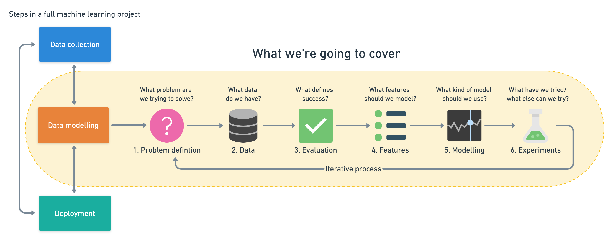

# Stocks Prediction
> *This project is part of a series worked on as a part of my Udacity Nanodegree program. As this is the capstone project, I have built it from scratch.*

> **Machine Learning Engineer Nanodegree at Udacity** *sponsored by AWS*

*Update October 29, 2020: I am working on the project and will be committing changes and I make them.*

---

# Table of Contents
- [Stocks Prediction](#stocks-prediction)
- [Table of Contents](#table-of-contents)
- [Table of Figures](#table-of-figures)
- [Capstone Proposal](#capstone-proposal)
  - [Domain Background](#domain-background)
  - [Problem Statement](#problem-statement)
  - [Datasets and Inputs](#datasets-and-inputs)
  - [Solution Statement](#solution-statement)
  - [Benchmark Model](#benchmark-model)
  - [Evaluation Metrics](#evaluation-metrics)
  - [Project Design](#project-design)
  - [References](#references)

# Table of Figures

[Figure 1: Example Stock Price vs Time graph with predicted values](images/metric-example-graph.png)

[Figure 2: Amazon SageMaker Workflow ](images/aws-ml-workflow.png)

[Figure 3: Typical Machine Learning Workflow (ZTM Udemy course)](images/ml101-6-step-ml-framework.png)

# Capstone Proposal

Raj Dholakia

October 8, 2020

## Domain Background

An ideal real-world application of machine learning is in the world of trading and investing. It all works on predicting what will have to the price of a stock in the next few minutes or a few years. Hence, the aim is to **predict** and there is a **large amount of historical data** available to assist in making a prediction. Laying out the foundation to apply some machine learning algorithms.

Having said that, the field is yet part of active research. The uncertain nature of stock prices and the time-series aspect of the problem makes it a particularly difficult one to solve. Then again, considering the fact that the field is all about money, a lot research has already been done. Even a decent prediction model, attracts a lot of attention in the field (Asadi _et al._, 2012; Agarwal and Sabitha, 2017)

There are two broad ways one can go about predicting the price of a stock. The first is through **technical analysis**. The historical price data of a stock is used to predict the future price. The second being **fundamental analysis** , which uses unstructured textural information to understand the market sentiment and predict what will happen to the price of a stock. Information sources for the latter approach include news and social media (Subhi Alzazah and Cheng, 2020).

One of the researches cited above worked on &quot;_SENSEX&#39;s Index dataset since 2006 to 2016 for time series forecasting using Rapid miner_&quot; (Agarwal and Sabitha, 2017). This is particularly important because we will be using two indices and one stock in this project.

I decided to take on this problem due to my interest in finance and some internship experience at a start-up that focuses on machine learning applications in intraday trading. I believe working on this project will give me a better understanding of the financial markets (finance in general) and time-series machine learning problems. As I have new to the world of machine learning and finance, I have decided to carry out technical analysis using the historical data of stocks.

## Problem Statement

**The aim of this project is to predict the long-term price trend of two indices and one stock with at least 90% accuracy.1** The stocks and indices will be chosen based on countries of interest and personal preference, but are clearly defined in the [Datasets and Inputs section](#Datasets-and-Inputs). In the end, the ability of the model will be tested by making predicting one full year worth of data. Furthermore, the model&#39;s ability to predict how the stocks performed in 2020 (the year of the pandemic) will be observed.

_1 90% accuracy can be taken as 10% mean absolute percentage error._

## Datasets and Inputs

Data selection is one of the easier parts of this project. As this is going to be a technical analysis, consisting of only the stock prices and volumes over the years, the data can be taken from a number of places. I have decided to take it from Yahoo Finance (_Yahoo Finance – stock market live, quotes, business &amp; finance news_, no date).

The selection of stocks to be worked on in this project. I want to encompass a wide range of stocks, which not only give a better understanding of the model&#39;s performance, but also a prediction with some confidence on how the economy of a country will move post the pandemic.

After some research, I have chosen the following:

1. **S&amp;P 500 (^GSPC):** This is a good index to understand the performance of the US stock market. (Banton, 2019)
2. **S&amp;P BSE SENSEX (^BSESN):** This is a good index to understand the performance of the Indian stock market. (_Stock Market Index : Meaning, Importance, NSE &amp; BSE and more_, 2020)
3. **Apple Inc. (AAPL):** Apple has been known to be a must-have stock in an investment portfolio and I am personally interested in seeing how a model performs on this stock.

The data for the above will be downloaded from the Yahoo Finance website. It will contain daily stock price data.

- S&amp;P 500: from December 30, 1927 to October 02, 2020
- S&amp;P BSE SENSEX: from July 01, 1997 to October 02, 2020
- Apple Inc.: from December 12, 1980 to October 02, 2020

The datasets will be split into training and test data according to a timeline, which will be determined after visualizing the data. As this is a time-series problem, this seems like an appropriate way to move forward.

## Solution Statement

Considering it is a time-series problem, I intend to use Amazon Sagemaker&#39;s DeepAR algorithm to make predictions and compare them to the results from an ARIMA model.

- The data will be split in a 90-10 format, where 90% of the historical data will be used to train the model and the 10% will be used to test the model&#39;s performance.
- The accuracy of the model will be measured by two metrics defined in the [Evaluation Metrics section](#Evaluation-Metrics).
- We will start by predicting thirty days of data and finally predict for the last one year (2020) of the data.

## Benchmark Model

The results obtained by Nagesh Singh Chauhan in his analysis of Altaba Inc. stock from _1996–04–12_ till _2017–11–10_ (Chauhan, no date). He managed to get a MAPE value of **3.5%**, which can be said to be **96.5% accuracy**, using a well-tuned **ARIMA model**. In this project, the goal will be to get the MAPE value to be less than 90%.

## Evaluation Metrics

I will be using two evaluation metrics to understand the model&#39;s performance.

1. **Mean Absolute Percentage Error (MAPE)**: It is the mean of percentage of absolute errors of the predictions. The following formula explains how it is calculated (&#39;MEAN ABSOLUTE PERCENTAGE ERROR (MAPE)&#39;, 2006; Glen, 2011) :

2. **Percentage Points Correctly Predicted** : It is the percentage of actual points that lie in the 30-70 (shorter inter-quartile) range of the predictions.

In the example graph above, it is clear that there are 3 out of 5 points fall in the 30-70 quartile range. Hence,

I came up with this metric as a solution to the problem predicting for larger intervals. I intend to use this to be understand of the model can make accurate predictions on the long-term trends. However, some weakness of the metric would be its inability to give great results for predictions with high variability (standard deviation). As a high standard deviation would be a larger area is covered by the predictions, the probability of the actual value to land within the 30-70 range is higher. However, if the standard deviation is high, the model is not following any specific trend (up or down) but is just spreading in both directions, leading to an inaccurate measure of what is actually happening.

Hence, a combination of MAPE and Percentage Points will give a better understanding of how the model is performing.

## Project Design

I will be using a combination of the above workflows for this project (AWS, 2019; Bourke and Neagoie, 2020). A combination will yeild to something as follows:

1. **Problem Definition: this proposal.**
2. **Exploratory Data Analysis:**
  1. **Load and Describe Data.**
  2. **Visualise and Understand Data.**
3. **Clean and Prepare Data.**
4. **Create and Train a model.**
5. **Deploy model as an endpoint and evaluate the performance.**
6. **Repeat STEPS 4 and 5 for another model or after tuning hyperparameters. Models to be considered:**
  3. **ARIMA**
  4. **DeepAR**
7. **Experiment to achieve the goal defined in the problem definition.**

The last step will be carried out throughout the process.

## References

Agarwal, U. and Sabitha, A. S. (2017) &#39;Time series forecasting of stock market index&#39;, in _India International Conference on Information Processing, IICIP 2016 - Proceedings_. Institute of Electrical and Electronics Engineers Inc. doi: 10.1109/IICIP.2016.7975381.

Asadi, S. _et al._ (2012) &#39;Hybridization of evolutionary Levenberg-Marquardt neural networks and data pre-processing for stock market prediction&#39;, _Knowledge-Based Systems_. Elsevier, 35, pp. 245–258. doi: 10.1016/j.knosys.2012.05.003.

AWS (2019) _Machine Learning with Amazon SageMaker_, _Amazon Web Services, Inc._ Available at: https://docs.aws.amazon.com/sagemaker/latest/dg/how-it-works-mlconcepts.html (Accessed: 7 October 2020).

Banton, C. (2019) _An Introduction to U.S. Stock Market Indexes_, _Investopedia_. Available at: https://www.investopedia.com/insights/introduction-to-stock-market-indices/ (Accessed: 4 October 2020).

Bourke, D. and Neagoie, A. (2020) _Complete Machine Learning and Data Science: Zero to Mastery | Udemy_, _Udemy_. Available at: https://www.udemy.com/course/complete-machine-learning-and-data-science-zero-to-mastery/ (Accessed: 7 October 2020).

Chauhan, N. S. (no date) _Stock Market Forecasting Using Time Series Analysis_. Available at: https://www.kdnuggets.com/2020/01/stock-market-forecasting-time-series-analysis.html (Accessed: 8 October 2020).

Glen, S. (2011) &#39;MEAN ABSOLUTE PERCENTAGE ERROR (MAPE)&#39;, in _SpringerReference_. doi: 10.1007/springerreference\_6919.

&#39;MEAN ABSOLUTE PERCENTAGE ERROR (MAPE)&#39; (2006) in _Encyclopedia of Production and Manufacturing Management_. Springer US, pp. 462–462. doi: 10.1007/1-4020-0612-8\_580.

_Stock Market Index : Meaning, Importance, NSE &amp; BSE and more_ (2020) _Defmacro Software Pvt. Ltd._ Available at: https://cleartax.in/s/stock-market-index (Accessed: 4 October 2020).

Subhi Alzazah, F. and Cheng, X. (2020) &#39;Recent Advances in Stock Market Prediction Using Text Mining: A Survey&#39;, in _E-Business [Working Title]_. IntechOpen. doi: 10.5772/intechopen.92253.

_Yahoo Finance – stock market live, quotes, business &amp; finance news_ (no date). Available at: https://in.finance.yahoo.com/ (Accessed: 2 October 2020).
